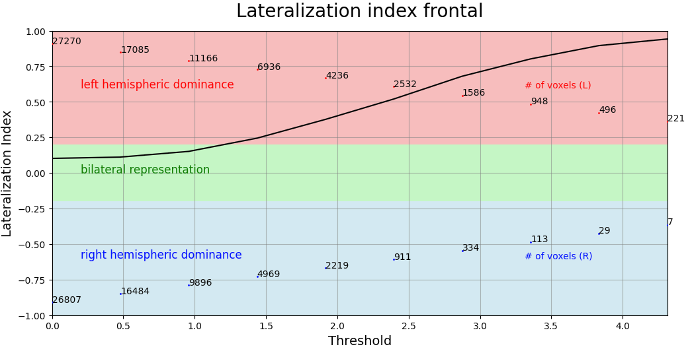

:orphan:

.. toctree::

+--------------------------------+-------------------------------------------+----------------------------------------------------+
|`Home <../../../../index.html>`_|`Documentation <../../documentation.html>`_|`GitHub <https://github.com/populse/mia_processes>`_|
+--------------------------------+-------------------------------------------+----------------------------------------------------+

==============================
LateralizationIndexCurve brick
==============================

Compute iteratively the lateralization of activation in functional MRI data.
----------------------------------------------------------------------------

The lateralization index (LI) as implemented here relies on the basic computation LI = (Left - Right) / (Left +
Right). Therefore, a negative value indicates a right hemispheric dominance and a positive value
indicates a left hemispheric dominance.

Here an iterative approach is used. It will compute LIs at up to 20 equally-spaced thresholds.

It is a python adaptation of the part 'Iterative (LI-curves)' of the SPM LI-toolbox (Matlab),
an integrated software package allowing for the investigation of laterality effects in imaging data.

If you are using this brick please cite: `Wilke M & Lidzba K <https://doi.org/10.1016/j.jneumeth.2007.01.026>`_: LI-tool: A new toolbox to assess
lateralization in functional MR-data, J Neurosci Meth, 2007, 163: 128-136.

*Please note that, for this brick, the* `mia_resources <https://gricad-gitlab.univ-grenoble-alpes.fr/mia/mia_resources>`_
*package should be added to* `Mia Preferences <https://populse.github.io/populse_mia/html/documentation/preferences.html>`_.

------------------------------------------------------------

Example of curve obtained:

--------------------------------------

**Mandatory inputs parameters:**

- *in_file* (a string representing an existing file)
    Input image (valid extensions: [.nii, .nii.gz]).
    Image from which signals have been extracted.

    ::

      ex. '/home/username/data/raw_data/sub-001_bold.nii'

- *ROI* (a list of string among frontal, temporal, parietal, occipital, cingulate, central, cerebellar, gray matter)
    List of the ROI.

    ::

      ex. ['temporal', 'frontal']

**Outputs parameters:**

- *out_png* (a list a pathlike object or string representing a file)
    Out png files.

    ::

      ex. [/home/username/data/derived_dat/patient/stats_gene/spmT_0002_LI_frontal.png,
      /home/username/data/derived_dat/patient/stats_gene/spmT_0002_LI_temporal.png]

-------------

Useful links:

- `SPM LI-toolbox <https://www.fil.ion.ucl.ac.uk/spm/ext/#LI>`_
- `[Wilke2007] <https://doi.org/10.1016/j.jneumeth.2007.01.026>`_
