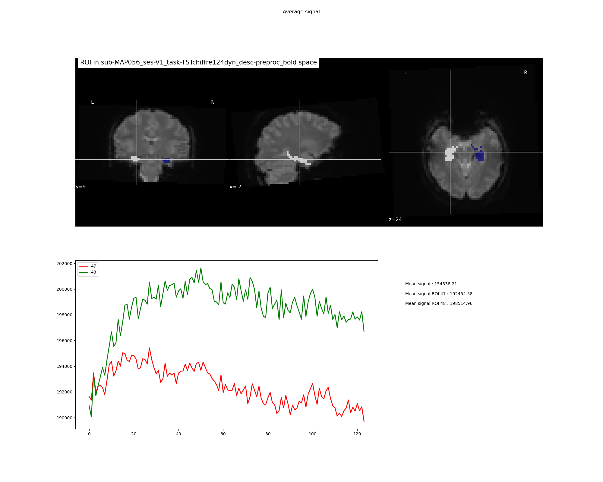

:orphan:

.. toctree::

+--------------------------------+-------------------------------------------+----------------------------------------------------+
|`Home <../../../../index.html>`_|`Documentation <../../documentation.html>`_|`GitHub <https://github.com/populse/mia_processes>`_|
+--------------------------------+-------------------------------------------+----------------------------------------------------+

===================
PlotSignalROI brick
===================

Plot signals from ROI using a segmentation file with label
------------------------------------------------------------

Example of png file obtained:

--------------------------------------

**Mandatory inputs parameters:**

- *in_file* (a string representing an existing file)
    Input image (valid extensions: [.nii, .nii.gz]).
    Image from which signals have been extracted.

    ::

      ex. '/home/username/data/raw_data/sub-001_bold.nii'

- *labels* (a list of integer)
    List of the labels of the ROI to plot

    ::

      ex. ['47', '48']

- *rois_files* (a string representing existing files or a list of string representing existing files)
    Could be either one image with all the ROI or one image by ROI

    ::

      ex. '/home/username/data/raw_data/native_structures_sub-001_bold_space_concate_47_48.nii'

    ::

      ex. ['/home/username/data/raw_data/native_structures_sub-001_bold_space_47.nii',
            '/home/username/data/raw_data/native_structures_sub-001_bold_space_48.nii']

- *signals* (a pathlike object or string representing an existing file)
    Extracted signal for each ROI in a csv file

    ::

      ex. '/home/username/data/raw_data/native_structures_sub-001_bold_space_1.csv'

**Optional inputs:**

- *signals_whole_brain* (a pathlike object or string representing an existing file)
    Extracted signal for all brain in a csv file. If if needed to have the average signal in the whole brain.

    ::

      ex. '/home/username/data/raw_data/native_structures_sub-001_bold_space_47_48.csv'

**Outputs parameters:**

- *out_png* (a pathlike object or string representing a file)
    Out png file

    ::

      ex. '/home/username/data/raw_data/sub-001_bold_extracted_signals_47_48.png'
