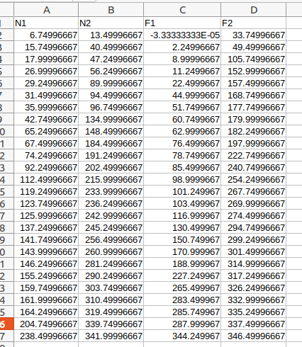
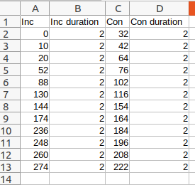

:orphan:

.. toctree::

+-----------------------------+-------------------------------------------+----------------------------------------------------+
|`Home <../../../index.html>`_|`Documentation <../../documentation.html>`_|`GitHub <https://github.com/populse/mia_processes>`_|
+-----------------------------+-------------------------------------------+----------------------------------------------------+

=============================
Get_Conditions_From_csv brick
=============================

Get conditions information (conditions names, onsets and durations) for `Level1Design <../../bricks/stats/spm/Level1Design.html>`_ brick using csv files.
One csv file should be used by session.

For event-related design, the csv file should contains one column by conditions with the onsets and the first row should contains the name of the condition:

For bloc design, the csv file should contains two columns by conditions: one with the onset and one with the duration.
The first row of the column with the onset should contains the name of the condition
and the first row of the column with the duration should contain the name of the condition + " duration":

-----------------------------------------------

**Inputs parameters:**

- *csv_files* (a list of existing csv files):
    csv files contening the conditions information for each condition.
    One csv file by session.

    ::

      ex. ['/home/username/MIA_projects/data/downloaded_data/sess01_bloc_onset.csv',
           '/home/username/MIA_projects//data/downloaded_data/sess02_event_onset.csv']

- *design_type* (a list of string which are bloc or event-related):
    The type of design for each session (bloc design or event-related design).
    The order should be the same as for the csv_files parameter.

    ::

      ex. ['bloc', 'event-related']

**Outputs parameters:**

- *cond_names* (a list of string):
    The list of the conditions names.

    ::

      ex. [['Inc', 'Con'], ['N1', 'N2', 'F1', 'F2']]

- *cond_onsets* (a list of list of float):
    The list of the conditions onsets.

    ::

      ex. [
        [
            [0.0, 10.0, 20.0, 52.0, 88.0, 130.0, 144.0, 174.0, 236.0, 248.0, 260.0, 274.0],
            [32.0, 42.0, 64.0, 76.0, 102.0, 116.0, 154.0, 164.0, 184.0, 196.0, 208.0, 222.0]
        ],
        [   [6.74996667, 15.74996667, 17.99996667, 26.99996667, 29.24996667, 31.49996667, 35.99996667, 42.74996667, 65.24996667, 67.49996667, 74.24996667, 92.24996667, 112.49996667, 119.24996667, 123.74996667, 125.99996667, 137.24996667, 141.74996667, 143.99996667, 146.24996667, 155.24996667, 159.74996667, 161.99996667, 164.24996667, 204.74996667, 238.49996667],
            [13.49996667, 40.49996667, 47.24996667, 56.24996667, 89.99996667, 94.49996667, 96.74996667, 134.99996667, 148.49996667, 184.49996667, 191.24996667, 202.49996667, 215.99996667, 233.99996667, 236.24996667, 242.99996667, 245.24996667, 256.49996667, 260.99996667, 281.24996667, 290.24996667, 303.74996667, 310.49996667, 319.49996667, 339.74996667, 341.99996667],
            [-3.33333333e-05, 2.24996667, 8.99996667, 11.2499667, 22.4999667, 44.9999667, 51.7499667, 60.7499667, 62.9999667, 76.4999667, 78.7499667, 85.4999667, 98.9999667, 101.249967, 103.499967, 116.999967, 130.499967, 150.749967, 170.999967, 188.999967, 227.249967, 265.499967, 283.499967, 285.749967, 287.999967, 344.249967],
            [33.74996667, 49.49996667, 105.74996667, 152.99996667, 157.49996667, 168.74996667, 177.74996667, 179.99996667, 182.24996667, 197.99996667, 222.74996667, 240.74996667, 254.24996667, 267.74996667, 269.99996667, 274.49996667, 294.74996667, 299.24996667, 301.49996667, 314.99996667, 317.24996667, 326.24996667, 332.99996667, 335.24996667, 337.49996667, 346.49996667]
        ]
        ]

- *cond_durations* (a list of string):
    The list of the conditions duration.

    ::

      ex. [
            [
                [2.0, 2.0, 2.0, 2.0, 2.0, 2.0, 2.0, 2.0, 2.0, 2.0, 2.0, 2.0],
                [2.0, 2.0, 2.0, 2.0, 2.0, 2.0, 2.0, 2.0, 2.0, 2.0, 2.0, 2.0]
            ],
            [
                [0.0],
                [0.0],
                [0.0],
                [0.0]
            ]
            ]
