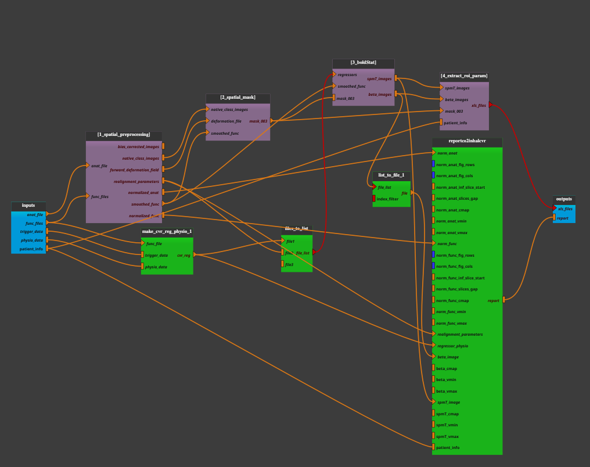

:orphan:

.. toctree::

+-----------------------------+-------------------------------------------+----------------------------------------------------+
|`Home <../../../index.html>`_|`Documentation <../../documentation.html>`_|`GitHub <https://github.com/populse/mia_processes>`_|
+-----------------------------+-------------------------------------------+----------------------------------------------------+

.. line break
.. |br| raw:: html

    

.. thin space
.. |ws1| raw:: html

   &thinsp;

.. em space

.. |ws2| raw:: html

   &emsp;

.. en space

.. |ws3| raw:: html

   &ensp;

.. non-breakable space

.. |ws4| raw:: html

   &nbsp;

=======================
CO2_inhalation pipeline
=======================

Cerebrovascular reactivity (CVR) evaluation under CO\ :sub:`2` challenge
------------------------------------------------------------------------

Functional magnetic resonance imaging (fMRI) experiments to assess
cerebrovascular reactivity (CVR) to hypercapnia (increased CO\ :sub:`2` levels)
typically involve inducing controlled changes in CO\ :sub:`2` levels while
measuring the resulting changes in brain activity.

Hypercapnia is induced by administering a gas mixture containing higher
than normal levels of CO\ :sub:`2` (typically around 8% CO\ :sub:`2`).
This can be achieved using a gas delivery system within the MRI scanner.
Participants breathe the gas mixture through a mask or a respiratory apparatus.

While hypercapnia is induced, fMRI data is continuously acquired to capture
changes in blood oxygenation level-dependent (BOLD) signals, which reflect
changes in cerebral blood flow.

Throughout the experiment, physiological parameters such as end-tidal
CO\ :sub:`2` (ETCO2) levels, heart rate, and respiratory rate are monitored to
ensure the effectiveness of hypercapnia induction and to account for
potential confounding effects. Trigger and physiological data are used
together to ensure that ETCO2 data are synchronized with imaging data.

The fMRI data are analyzed using a GLM approach. An `ETCO2
regressor <../../bricks/tools/Make_CVR_reg_physio.html>`_ is included in the
model to account for variations in CO\ :sub:`2` levels. Other potential confounding
variables (e.g. motion parameters) are also included as regressors.

A report is generated at the end of the analysis with the main statistical
results obtained.

--------------------

**Pipeline insight**

- The `CO2_inhalation` pipeline combines the following bricks:
    - `Bold_spatial_preprocessing1  <../../pipelines/preprocess/Bold_spatial_preprocessing1.html>`_
    - `Spatial_mask  <../../pipelines/preprocess/Spatial_mask.html>`_
    - `Bold_stat_cvr <../../pipelines/stat/Bold_stat_cvr.html>`_
    - `Extract_roi_param <../../pipelines/reports/Extract_roi_param.html>`_
    - `Make_CVR_reg_physio <../../bricks/tools/Make_CVR_reg_physio.html>`_
    - `Files_To_List  <../../bricks/tools/Files_To_List.html>`_
    - `List_To_File  <../../bricks/tools/List_To_File.html>`_
    - `ReportCO2inhalCvr  <../../bricks/reports/ReportCO2inhalCvr.html>`_

--------------------

**Inputs parameters**

- *anat_file*
    An anatomical image (ex. 3D T1 sequence such as T1 turbo field echo).
    An existing, uncompressed file (valid extensions: [.img, .nii, .hdr]).

    ::

      ex. /home/username/data/raw_data/Anat.nii

- *func_files*
    Functional images (ex. 4D T2* sequence such as echo planar imaging).
    A list of items which are an existing, uncompressed file (valid
    extensions: [.img, .nii, .hdr]).

    ::

      ex. ['/home/username/data/raw_data/Func.nii']

- *trigger_data*
    The trigger data, to ensure that ETCO2 data (physiological data) are
    synchronized with imaging data. An existing file,
    exclusively in [.txt, .csv, .log] format.

    ::

      ex. '/home/username/data/downloaded_data/trigger_time.log'

- *physio_data*
    The physiological data, including ETCO2 levels, measured during the
    neuroimaging scan. An existing file, exclusively in [.txt, .csv] format.

    ::

      ex. '/home/username/data/downloaded_data/physio_data.csv'

- *patient_info*
    A dictionary for entering patient data.
       - PatientRef: the patient's code name
       - Pathology: the patient's pathology
       - Age: patient's age
       - Sex: patient's sex
       - MR: MR-imager used,
       - Gas: Stimulation gas: Carbogen, Bactal, Variocap, etc.
       - GasAdmin : Stimulation gas administration: Mask, Cannula, etc.

    ::

      ex. {'PatientRef': 'bob_01', 'Pathology': 'ACMD', 'Age': 57,
           'Sex': 'F', 'MR': '3T', 'Gas': 'Bactal', 'GasAdmin': 'Mask'}

**Outputs parameters:**

- *xls_files*
    A tab-delimited text file containing a summary of the statistical results
    obtained (e.g. laterality indices, mean values, standard deviations, etc.)
    in the regions of interest.

    ::

      ex. ['/home/username/data/derived_data/PatientRef_data/results_aggregation/BOLD_IL_mean_spmT.xls',
           '/home/username/data/derived_data/PatientRef_data/results_aggregation/BOLD_std_beta.xls',
           '/home/username/data/derived_data/PatientRef_data/results_aggregation/BOLD_IL_std_beta.xls',
           '/home/username/data/derived_data/PatientRef_data/results_aggregation/BOLD_mean_spmT.xls',
           '/home/username/data/derived_data/PatientRef_data/results_aggregation/BOLD_mean_beta.xls',
           '/home/username/data/derived_data/PatientRef_data/results_aggregation/BOLD_IL_mean_beta.xls',
           '/home/username/data/derived_data/PatientRef_data/results_aggregation/BOLD_std_spmT.xls',
           '/home/username/data/derived_data/PatientRef_data/results_aggregation/BOLD_IL_std_spmT.xls']

- *report*
    The output generated report (.pdf). The summary of analysis, including
    laterality indices in various territories for statistical results
    (beta coefficients and t-statistical values, derived from GLM) plots.

    ::

      ex. '/home/username/data/derived_data/PatientRef_CO2_inhal_CVR_Report_2024_03_19_11_01_15_04.pdf'
