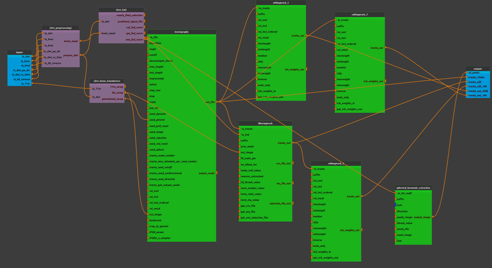

:orphan:

.. toctree::

+-----------------------------+-------------------------------------------+----------------------------------------------------+
|`Home <../../../index.html>`_|`Documentation <../../documentation.html>`_|`GitHub <https://github.com/populse/mia_processes>`_|
+-----------------------------+-------------------------------------------+----------------------------------------------------+

====================================
Dwi_whole_brain_tractograpy pipeline
====================================

Brain Tractography with MRTrix
-------------------------------
The aim of this pipeline is to create a whole-brain tractogram for a multishell DWI using Constrained Spherical Deconvolution (CSD).
In this pipeline, an image with b=0 volumes with opposite phase encoding should be provided for the purpose of EPI distortion correction.
An anatomical image is also required.

| This pipeline used several algorithms in order to improve the biological plausibility of fiber tracking :
| - Anatomically Constrained Tractography (ACT) which rejects streamlines that end in biologically implausible tissue
| - Spherical-deconvolution informed filtering of tractograms (SIFT) which corrects for the fact that longer streamlines tend to be overestimated in tractography
| - Multi-shell multi-tissue (MSMTT) CSD which exploites the differences in b-value sensitivity of different tissue types to estimate fibre orientation distributions in each tissue

| The following steps are done:
| **1. Preprocessing**
| - Denoising
| - Unringing
| - Motion and distortion correction
| - Bias field correction
| - Brain mask estimation

| **2. Estimation of fiber orientation distribution (FOD)**
| - Response function estimation
| - Estimation of FOD
| - Intensity Normalization

| **3. Preparing ATC**
| - Create a mask with 5 different tissue types (mask for streamline termination)
| - Coregistration with DWI
| - Create a mask of the gray-matter/white-matter-boundary (mask of streamline seeding)

| **4. Create streamlines**
| - Create tractography (10 million streamlines)
| - Randomly choose a subset of the 10 million tracks and create a 200k tracks and a 10k tracks
| - Filter the tractograms to reduce CSD-based bias in overestimation of longer tracks compared to shorter tracks, and reduce the number of streamlines
| - Extract the peaks of a spherical harmonic function in each voxel (could be used for others softawres as `TractSeg <https://github.com/MIC-DKFZ/TractSeg>`_)

The pipeline is based on `B.A.T.M.A.N. tutorial <https://osf.io/fkyht/>`_ and `Andy's brain book tutorial <https://andysbrainbook.readthedocs.io/en/latest/MRtrix/MRtrix_Introduction.html>`_

Note that this pipeline used the FLIRT registration (FSL) to co-register diffusion and anatomical data as suggested in the `B.A.T.M.A.N. tutorial <https://osf.io/fkyht/>`_.
However it seems to not work perfectly for some data.

**Test this pipeline :** use the sub-002 from `mia_data_users <https://gricad-gitlab.univ-grenoble-alpes.fr/mia/mia_data_users>`_.

--------------------------------------

**Pipeline insight**

| DWI_whole_brain_tractograpy pipeline combines the following pipelines and processes:
|   - `Dwi preprocessing <../../pipelines/preprocess/Dwi_preprocessing.html>`_
|   - `FOD estimation <../../pipelines/preprocess/Dwi_fod_msmt_csd.html>`_
|   - `Create tissue boundaries <../../pipelines/preprocess/Dwi_tissue_boundaries.html>`_
|   - `Create tractography <../../bricks/preprocess/mrtrix/Tractography.html>`_
|   - `Editing tractography <../../bricks/preprocess/mrtrix/EditingTrack.html>`_
|   - `Filtering tractography <../../bricks/preprocess/mrtrix/FilteringTrack.html>`_
|   - `Spherical harmonic extraction <../../bricks/preprocess/mrtrix/SphericalHarmonicExtraction.html>`_

**Mandatory inputs parameters**

- *in_dwi* (a string representing an existing file)
    Diffusion image to preprocess (valid extensions: [.nii, .nii.gz, .mif]).
    If a NIfTI is supplied, bvec and bval files will be found automatically.

    ::

      ex. '/home/username/data/raw_data/DWI.nii'

- *in_dwi_pe_dir* (ap, pa, lr, rl, default value is ap, optional)
    | Phase encoding direction of the in_diw image:
    |   - ap : Anterior to posterior
    |   - pa: Posterior to anterior
    |   - lr: Left to right
    |   - rl: Right toleft

    ::

      ex. ap

- *in_dwi_ro_time* (a float, optional)
    Total readout time of in_dwi image (in seconds).

    ::

      ex. 2.0

- *in_b0_reverse* (a string representing an existing file)
    b=0 volumes with opposing phase-direction which is to be used exclusively by topup for estimating the inhomogeneity field
    (valid extensions: [.nii, .nii.gz, .mif]).

    ::

      ex. '/home/username/data/raw_data/b0_reverse.nii'

- *in_T1w* (a string representing an existing file)
    Anatomical image (valid extensions: [.nii, .nii.gz]).

    ::

      ex. '/home/username/data/raw_data/T1w.nii'

**Outputs parameters:**

- *sh_peaks* (a string representing a file)
    The peaks of a spherical harmonic function in each voxel
    Each volume corresponds to the x, y & z component of each peak direction vector in turn.

    ::

      ex. '/home/username/data/derived_data/DWI_denoised_unringed_dwifslpreproc_unbias_wm_odf_norm_peaks.mif'

- *tracks_10mio* (a string representing a file)
    The tractography with 10 million streamlines

    ::

      ex. '/home/username/data/derived_data/DWI_denoised_unringed_dwifslpreproc_unbias_wm_odf_norm_tracto.tck'

- *tracks_200k* (a string representing a file)
    The reduce tractography with 200k streamlines

    ::

      ex. '/home/username/data/derived_data/DWI_denoised_unringed_dwifslpreproc_unbias_wm_odf_norm_tracto_200k.tck'

- *tracks_10k* (a string representing a file)
    The reduce tractography with 10k streamlines

    ::

      ex. '/home/username/data/derived_data/DWI_denoised_unringed_dwifslpreproc_unbias_wm_odf_norm_tracto_10k.tck'

- *tracks_sift* (a string representing a file)
    The tractography filtered such that the streamline densities match the FOD lobe integrals

    ::

      ex. '/home/username/data/derived_data/DWI_denoised_unringed_dwifslpreproc_unbias_wm_odf_norm_tracto_sift.tck'

- *tracks_sift_10k* (a string representing a file)
    The reduce sift tractography with 10k streamlines

    ::

      ex. '/home/username/data/derived_data/DWI_denoised_unringed_dwifslpreproc_unbias_wm_odf_norm_tracto_10k.tck'

- *T1w_coreg* (a string representing a file)
    Anatomical image coregistered in DWI space.

    ::

      ex. '/home/username/data/derived_data/T1w_transformed.mif'

-------------

Useful links:
`MRTrix <https://mrtrix.readthedocs.io/en/latest/>`_
`Tutorial B.A.T.M.A.N.: Basic and Advanced Tractography with MRtrix for All Neurophiles <https://osf.io/fkyht/>`_
`Tutorial Andy's brain book <https://andysbrainbook.readthedocs.io/en/latest/MRtrix/MRtrix_Introduction.html>`_
