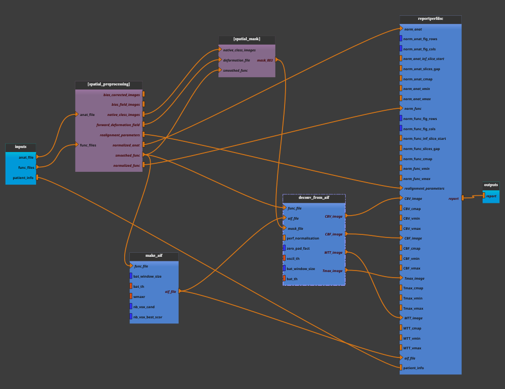

:orphan:

.. toctree::

+-----------------------------+-------------------------------------------+----------------------------------------------------+
|`Home <../../../index.html>`_|`Documentation <../../documentation.html>`_|`GitHub <https://github.com/populse/mia_processes>`_|
+-----------------------------+-------------------------------------------+----------------------------------------------------+

================
Perfdsc pipeline
================

Perfusion Dynamic Susceptibility Contrast MRI
---------------------------------------------

Perfusion DSC (Dynamic Susceptibility Contrast) MRI is a widely used imaging technique
in clinical and research settings to measure cerebral perfusion, which refers to the
flow of blood through the brain's vasculature.

It involves the injection of a contrast agent (usually gadolinium-based) and
rapid imaging to track the passage of this contrast through the blood vessels.
This typically involves echo-planar imaging (EPI) sequences. As the contrast agent
passes through the blood vessels, it creates local magnetic field inhomogeneities,
leading to changes in the MR signal.

The acquired data are processed to generate various perfusion maps, such as:

    - Cerebral Blood Volume (CBV): Indicates the volume of blood within a given
      amount of brain tissue.

    - Cerebral Blood Flow (CBF): Measures the rate at which blood is delivered
      to brain tissue.

    - Mean Transit Time (MTT): The average time it takes for the contrast agent
      to pass through the brain's vasculature.

    - Time to Peak (TTP): The time it takes for the contrast agent concentration
      to reach its maximum in the tissue.

**Test this pipeline :** use the sub-001 from `mia_data_users <https://gricad-gitlab.univ-grenoble-alpes.fr/mia/mia_data_users>`_.

--------------------------------------

**Pipeline insight**

- The `Perfdsc` pipeline combines the following pipelines and processes:
    - `Bold_spatial_preprocessing1 <../../pipelines/preprocess/Bold_spatial_preprocessing1.html>`_
    - `Spatial_mask <../../pipelines/preprocess/Spatial_mask.html>`_
    - `Make_AIF <../../bricks/tools/Make_AIF.html>`_
    - `Deconv_from_aif <../../bricks/tools/Deconv_from_aif.html>`_
    - `ReportPerfDsc <../../bricks/reports/ReportPerfDsc.html>`_

--------------------

**Inputs parameters**

- *anat_file*
    An anatomical image (ex. 3D T1 sequence such as T1 turbo field echo).
    An existing, uncompressed file (valid extensions: [.img, .nii, .hdr]).

    ::

      ex. /home/username/data/raw_data/Anat.nii

- *func_files*
    Functional images (ex. 4D T2* sequence such as echo planar imaging).
    A list of items which are an existing, uncompressed file (valid
    extensions: [.img, .nii, .hdr]).

    ::

      ex. ['/home/username/data/raw_data/Func.nii']

- *patient_info*
    A dictionary for entering patient data.
       - PatientRef: the patient's code name
       - Pathology: the patient's pathology
       - Age: patient's age
       - Sex: patient's sex
       - MR: MR-imager used

    ::

      ex. {'PatientRef': 'bob_01', 'Pathology': 'ACMD', 'Age': 57, 'Sex': 'F', 'MR': '3T'}

**Outputs parameters:**

- *report*
    The output generated report (.pdf). The summary of analysis, including
    CBV, CBF, TTP and MTT plots.

    ::

      ex. '/home/username/data/derived_data/bob_01_Perf_DSC_Report_2024_10_23_06_11_12_36.pdf'
