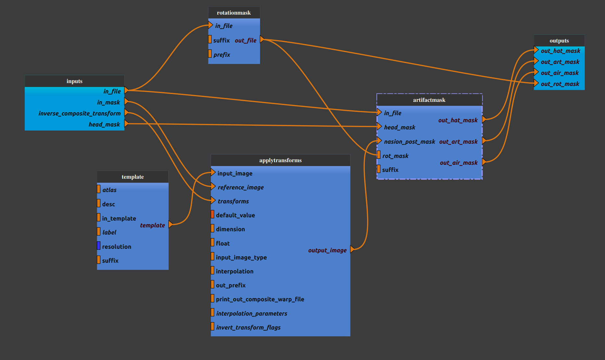

:orphan:

.. toctree::

+-----------------------------+-------------------------------------------+----------------------------------------------------+
|`Home <../../../index.html>`_|`Documentation <../../documentation.html>`_|`GitHub <https://github.com/populse/mia_processes>`_|
+-----------------------------+-------------------------------------------+----------------------------------------------------+

================================
Anat_airmask pipeline
================================

Compute rotation mask, air mask, artifact mask and hat mask for structural data following step 1 from (`[Mortamet2009] <https://onlinelibrary.wiley.com/doi/10.1002/mrm.21992>`_).

Adapted from `mriqc <https://mriqc.readthedocs.io/en/22.0.6//>`_ anatomical workflow.

--------------------------------------

**Pipeline insight**

| Anat_airmask pipeline combines the following pipelines and processes:
|   - `Rotation mask  <../../bricks/preprocess/others/RotationMask.html>`_
|   - `Apply Transform <../../bricks/preprocess/ants/ApplyTransform.html>`_
|      (default values: interpolation = 'MultiLabel')
|   - `Artifact mask  <../../bricks/preprocess/others/ArtifactMask.html>`_
|   - `Get template from templateFlow  <../../bricks/preprocess/others/TemplateFromTemplateFlow.html>`_
|      (default values : in_template = 'MNI152NLin2009cAsym', resolution = 1, suffix = 'mask', desc = 'head')

**Mandatory inputs parameters**

- *head_mask* (a string representing an existing file)
    Head mask (valid extensions: [.nii, .nii.gz]).

    ::

      ex. '/home/username/data/raw_data/T1w_brain_outskin.nii'

- *inverse_composite_transform* (a string representing an existing file)
    Inverse composite transform used in "ApplyTransform" process (MNI space --> in_file space).

    ::

      ex. '/home/username/data/raw_data/T1w_masked_InverseComposite.h5'

- *in_file* (a string representing an existing file)
    An anatomical image (T1w or T2w) (valid extensions: [.nii, .nii.gz]).

    ::

      ex. '/home/username/data/raw_data/T1w.nii'

- *in_mask* (a string representing an existing file)
    Mask image used as reference image in "ApplyTransform" process (valid extensions: [.nii, .nii.gz]).

    ::

      ex. '/home/username/data/raw_data/T1w_brain_mask.nii'

**Outputs parameters:**

- *out_air_mask*
    Air mask.

    ::

      ex. '/home/username/data/derived_data/air_T1w_mask.nii'

- *out_art_mask*
    Artifact mask.

    ::

      ex. '/home/username/data/derived_data/art_T1w_mask.nii'

- *out_hat_mask*
    Hat mask.

    ::

      ex. '/home/username/data/derived_data/hat_T1w_mask.nii'

- *out_rot_mask*
    Rotation mask.

    ::

      ex. '/home/username/data/derived_data/rot_T1w_mask.nii'

-------------

Usefull links:
`[Mortamet2009] <https://onlinelibrary.wiley.com/doi/10.1002/mrm.21992>_`
