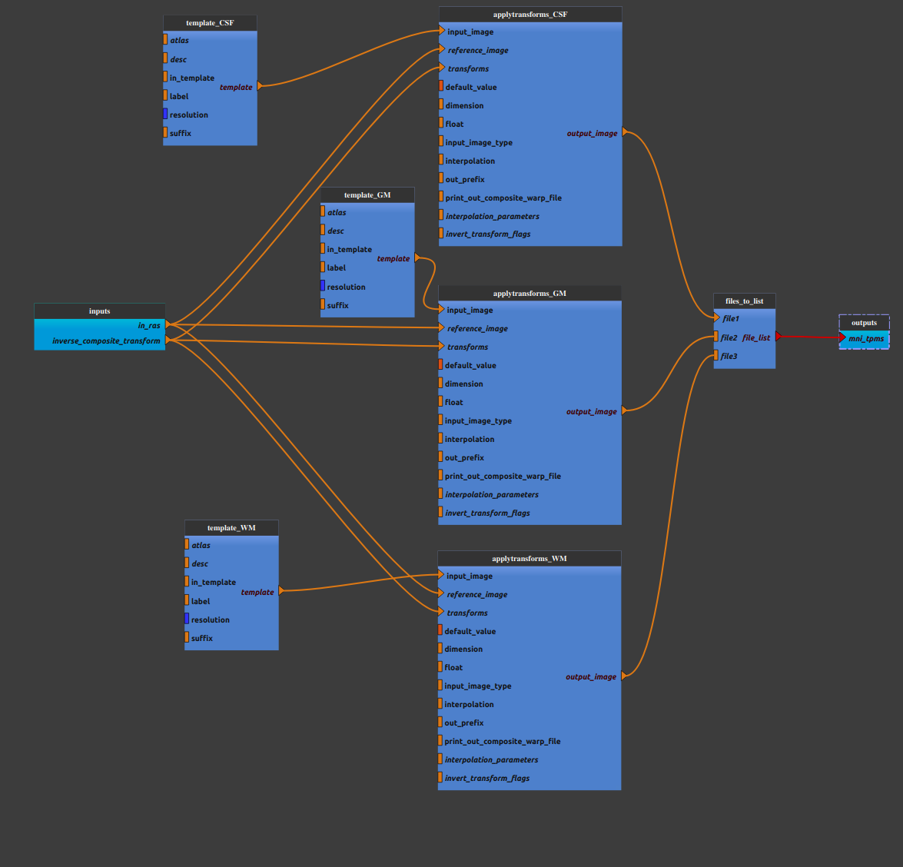

:orphan:

.. toctree::

+-----------------------------+-------------------------------------------+----------------------------------------------------+
|`Home <../../../index.html>`_|`Documentation <../../documentation.html>`_|`GitHub <https://github.com/populse/mia_processes>`_|
+-----------------------------+-------------------------------------------+----------------------------------------------------+

================================
Anat_mni_tpms pipeline
================================

Get templates tissues probability map (white matter (WM), grey matter (GM) and cerebrospinal (CSF)) 
from 'MNI152NLin2009cAsym' template (resolution 1 mm) and register them in subject space.  

Adapted from `mriqc <https://mriqc.readthedocs.io/en/22.0.6//>`_ anatomical workflow.

--------------------------------------

**Pipeline insight**

| Anat_mni_tpms pipeline combines the following pipelines and processes:
|   - `Get tissue map templates (CSF, GM and WM) from templateFlow  <../../bricks/preprocess/others/TemplateFromTemplateFlow.html>`_ 
|       (default values : in_template = 'MNI152NLin2009cAsym', resolution = 1, suffix = 'probseg', label = 'CSF' or 'GM' or 'WM')
|   - `Apply Transform <../../bricks/preprocess/ants/ApplyTransform.html>`_ 
|       (default values: interpolation = 'Linear')

**Mandatory inputs parameters**

- *inverse_composite_transform* (a string representing an existing file)
    Inverse composite transform used in "ApplyTransform" process (MNI space --> 'in_ras' space).

    ::

      ex. '/home/username/data/raw_data/T1w_masked_InverseComposite.h5'

- *in_ras* (a string representing an existing file)
    An anatomical image (T1w or T2w) (valid extensions: [.nii, .nii.gz]).

    ::

      ex. '/home/username/data/raw_data/T1w.nii'

**Outputs parameters:**

- *mni_tpms* (a list representing files)
    Air mask. 

    ::

      ex. ['/home/username/data/derived_data/csf_tpl-MNI152NLin2009cAsym_res-01_label-CSF_probseg.nii', '/home/username/data/derived_data/gm_tpl-MNI152NLin2009cAsym_res-01_label-GM_probseg.nii', '/home/username/data/derived_data/wm_tpl-MNI152NLin2009cAsym_res-01_label-WM_probseg.nii']

-------------

Usefull links:

`mriqc v22.06 <https://github.com/nipreps/mriqc/blob/22.0.6/mriqc/workflows/anatomical.py#L408>_`
