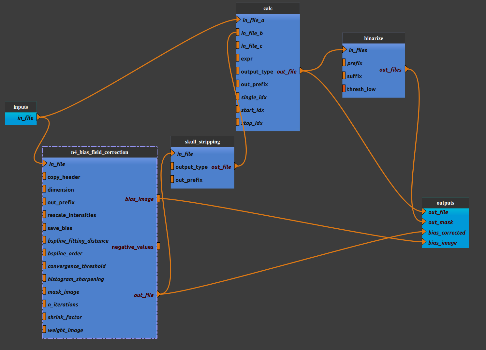

:orphan:

.. toctree::

+-----------------------------+-------------------------------------------+----------------------------------------------------+
|`Home <../../../index.html>`_|`Documentation <../../documentation.html>`_|`GitHub <https://github.com/populse/mia_processes>`_|
+-----------------------------+-------------------------------------------+----------------------------------------------------+

================================
Anat_skullstrip pipeline
================================

Bias correction and skull stripping of a structural image.

--------------------------------------

**Pipeline insight**

| Anat_skullstrip pipeline combines the following pipelines and processes:
|   - `Bias field correction <../../bricks/preprocess/ants/N4BiasFieldCorrection.html>`_ (using ANTs N4BiasFieldCorrection)
|       (default: dimension = 3)
|   - `Skull Stripping <../../bricks/preprocess/afni/SkullStrip.html>`_  (using AFNI SkullStrip)
|   - `Calc <../../bricks/preprocess/afni/Calc.html>`_
|       (default expr = 'a*step(b)')
|   - `Binarize <../../bricks/preprocess/others/Binarize.html>`_

**Mandatory inputs parameters**

- *in_file* (a string representing an existing file)
    Anatomical image (T1w or T2w) (valid extensions: [.nii, .nii.gz]).

    ::

      ex. '/home/username/data/raw_data/T1w.nii'

**Outputs parameters:**

- *bias_corrected*
    Bias corrected image.

    ::

      ex. '/home/username/data/derived_data/n4c_T1w.nii'

- *bias_image*
    Bias image.

    ::

      ex. '/home/username/data/derived_data/n4c_T1w_bias.nii'

- *out_file*
    Skull stripped image.

    ::

      ex. '/home/username/data/derived_data/ss_orig_T1w.nii'

- *out_mask*
    Head mask.

    ::

      ex. '/home/username/data/derived_data/ss_orig_T1w_bin.nii'

-------------
