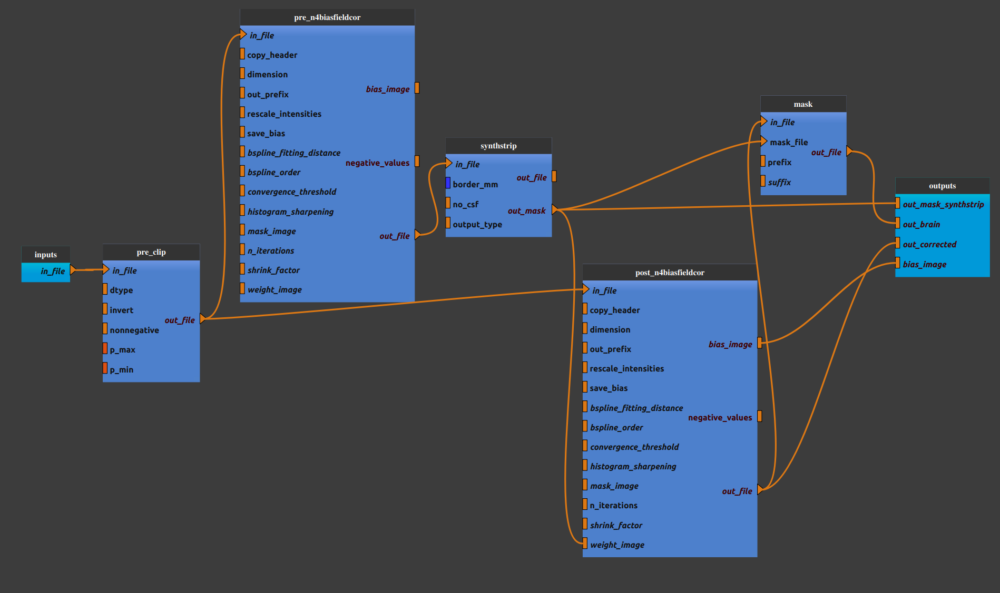

:orphan:

.. toctree::

+-----------------------------+-------------------------------------------+----------------------------------------------------+
|`Home <../../../index.html>`_|`Documentation <../../documentation.html>`_|`GitHub <https://github.com/populse/mia_processes>`_|
+-----------------------------+-------------------------------------------+----------------------------------------------------+

======================================
Anat_skullstrip_synthstrip pipeline
======================================

Create a brain-extraction workflow using SynthStrip (Freesurfer).

Adapted from `mriqc v22.06 synthstrip workflow <https://github.com/nipreps/mriqc/blob/5a0f0408bd0c176dbc46088c6ffe279269180f3f/mriqc/workflows/anatomical.py#L849>`_

--------------------------------------

**Pipeline insight**

| Anat_skullstrip_synthstrip pipeline combines the following pipelines and processes:
|   - `Bias field correction <../../bricks/preprocess/ants/N4BiasFieldCorrection.html>`_ (using ANTs N4BiasFieldCorrection)
|       (default for first correction: dimension = 3, rescale_intensities = True,
|       default for second correction: dimension = 3, n_iterations = [50] * 4)
|   - `Skull Stripping <../../bricks/preprocess/afni/SkullStrip.html>`_  (using Freesurfer Synthstrip)
|   - `Intesity Clip <../../bricks/preprocess/others/IntensityClip.html>`_
|   - `Mask <../../bricks/preprocess/others/Mask.html>`_ 

**Mandatory inputs parameters**

- *in_file* (a string representing an existing file)
    Anatomical image (T1w or T2w) (valid extensions: [.nii, .nii.gz]).

    ::

      ex. '/home/username/data/raw_data/T1w.nii'

**Outputs parameters:**

- *bias_image*
    Bias image.

    ::

      ex. '/home/username/data/derived_data/n4c_T1w_clipped_bias.nii'

- *out_corrected*
    Bias corrected image. 

    ::

      ex. '/home/username/data/derived_data/n4c_T1w_clipped.nii'

- *out_brain*
    Skull stripped image. 

    ::

      ex. '/home/username/data/derived_data/ss_n4c_T1w_clipped.nii'

- *out_mask*
    Head mask from SynthStrip. 

    ::

      ex. '/home/username/data/derived_data/pre_n4c_T1w_clipped_desc_brain_mask.nii'
    
-------------

Usefull links:

`SynthStrip <https://surfer.nmr.mgh.harvard.edu/docs/synthstrip/>`_
`mriqc synthstrip workflow <https://mriqc.readthedocs.io/en/22.0.6/workflows.html#mriqc.workflows.anatomical.synthstrip_wf>`_

