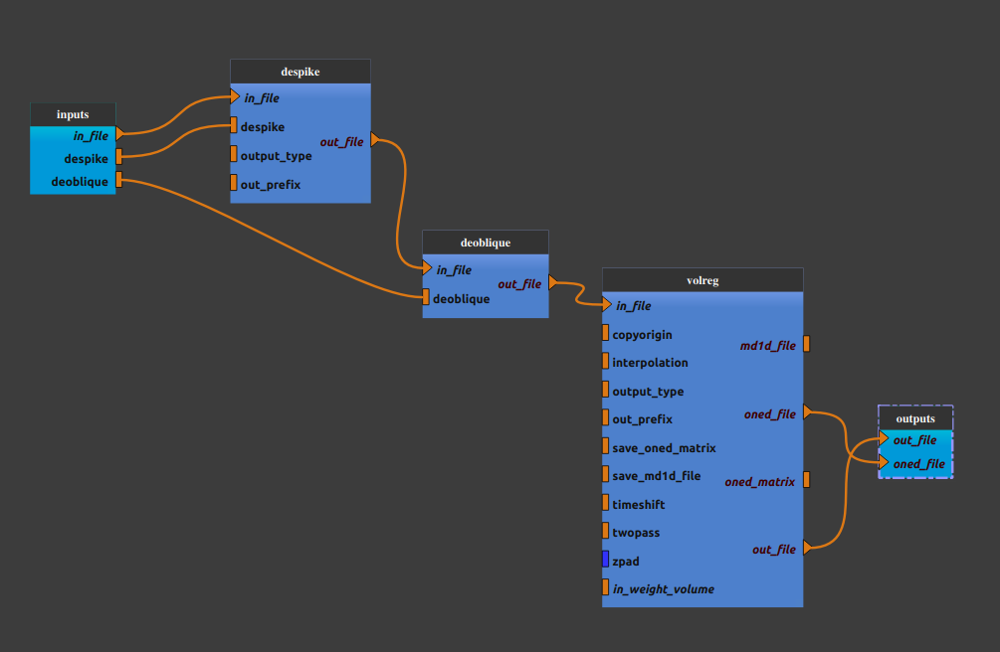

:orphan:

.. toctree::

+-----------------------------+-------------------------------------------+----------------------------------------------------+
|`Home <../../../index.html>`_|`Documentation <../../documentation.html>`_|`GitHub <https://github.com/populse/mia_processes>`_|
+-----------------------------+-------------------------------------------+----------------------------------------------------+

=================
Bold_hmc pipeline
=================

Head motion correction of a bold image
--------------------------------------

Adapted from `bold HCM pipeline in mriqc 22.06 <https://github.com/nipreps/mriqc/blob/22.0.6/mriqc/workflows/functional.py#L666>`_

--------------------------------------

**Pipeline insight**

| Bold_hcm pipeline combines the following pipelines and processes:
|   - `Despike <../../bricks/preprocess/afni/Despike.html>`_
|   - `Deoblique <../../bricks/preprocess/ants/RefitDeoblique.html>`_
|   - `Volume Registration <../../bricks/preprocess/afni/VolReg.html>`_

**Mandatory inputs parameters**

- *in_file* (a string representing an existing file)
    Functional image (valid extensions: [.nii, .nii.gz]).

    ::

      ex. '/home/username/data/raw_data/func.nii'

**Optional inputs parameters with a default value**

- *despike* (a boolean, optional)
    Despike step done if True.

    ::

      ex. False (default value)

- *deobliqe* (a boolean, optional)
    Deoblique step done if True.

    ::

      ex. False (default value)

**Outputs parameters:**

- *oned_file*
    Movement parameters file (extensions: [.txt]).

    ::

      ex. '/home/username/data/derived_data/reg_d_func_oned.txt'

- *out_file*
    Register file (extensions: [.nii, .nii.gz]).

    ::

      ex. '/home/username/data/derived_data/reg_d_func.nii'

-------------

Useful links:

`mriq HMC pipeline <https://mriqc.readthedocs.io/en/22.0.6/workflows.html#mriqc.workflows.functional.hmc>`_
