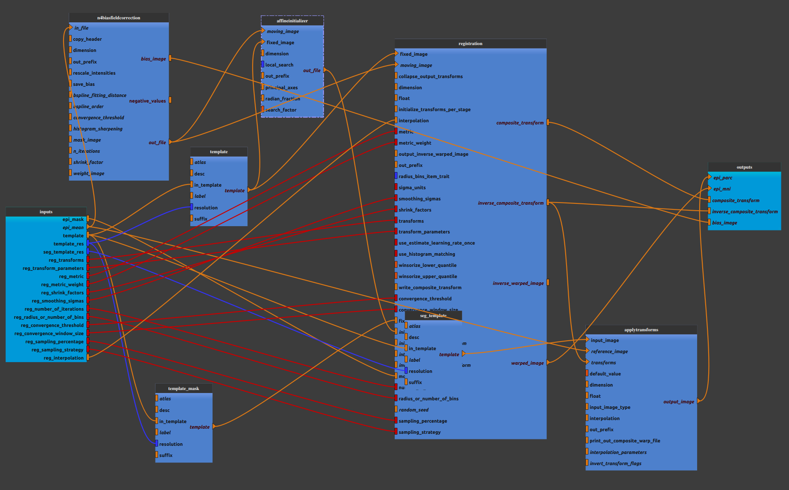

:orphan:

.. toctree::

+-----------------------------+-------------------------------------------+----------------------------------------------------+
|`Home <../../../index.html>`_|`Documentation <../../documentation.html>`_|`GitHub <https://github.com/populse/mia_processes>`_|
+-----------------------------+-------------------------------------------+----------------------------------------------------+

================================
Bold_mni_align pipeline
================================

Registered a mean functional image EPI in MNI space (for checking out registration).

Adapted from `mriqc 22.06 <https://github.com/nipreps/mriqc/blob/22.0.6/mriqc/workflows/functional.py#L753>`_

--------------------------------------

**Pipeline insight**

| Bold_mni_align combines the following pipelines and processes:
|   - `Bias field correction <../../bricks/preprocess/ants/N4BiasFieldCorrection.html>`_ (using ANTs N4BiasFieldCorrection)
|       (default: dimension = 3)
|   - `Affine Initilizer <../../bricks/preprocess/ants/AffineInitializer.html>`_ 
|   - `Get template from templateFlow  <../../bricks/preprocess/others/TemplateFromTemplateFlow.html>`_ 
|      (default values for template : in_template = 'MNI152NLin2009cAsym', resolution = 2, suffix = 'boldref',  desc ='fMRIPrep'
|       default values for template mask : in_template = 'MNI152NLin2009cAsym', resolution = 2, suffix = 'mask', desc ='brain'
|       default values for template seg : in_template = 'MNI152NLin2009cAsym', resolution = 1, suffix = 'dseg', desc ='carpet')
|   - `Registration <../../bricks/preprocess/ants/Registration.html>`_ 
|       (default values:
|       convergence_threshold = [1e-06, 1e-06, 1e-06],
|       convergence_window_size = [20, 20, 10],
|       interpolation = 'LanczosWindowedSinc',
|       metric = ['Mattes', 'Mattes', 'CC'],
|       metric_weight = [1, 1, 1],
|       number_of_iterations = [[10000, 1000, 100], [500, 250, 100], [100, 30, 20]],
|       radius_or_number_of_bins = [56, 56, 4],
|       sampling_percentage = [0.25, 0.25, 1.0],
|       sampling_strategy = ['Regular', 'Regular', 'None'],
|       shrink_factors = [[4, 2, 1], [8, 4, 2], [8, 4, 2]],
|       smoothing_sigmas = [[4.0, 2.0, 1.0], [4.0, 2.0, 0.0], [3.0, 2.0, 1.0]],
|       transform_parameters = [(0.05,), (0.08,), (0.1, 3.0, 0.0)], 
|       transforms = ['Rigid', 'Affine', 'SyN'])
|   - `Apply Transform <../../bricks/preprocess/ants/ApplyTransform.html>`_ 
|      (default values: interpolation = 'MultiLabel')

**Mandatory inputs parameters**

- *epi_mask* (a string representing an existing file)
    Functional image brain mask (valid extensions: [.nii, .nii.gz]).

    ::

      ex. '/home/username/data/raw_data/automask_mean_reg_func_valid.nii'
  
- *epi_mean* (a string representing an existing file)
    Mean functional image (valid extensions: [.nii, .nii.gz]).

    ::

      ex. '/home/username/data/raw_data/mean_reg_func_valid.nii'

**Optional inputs parameters with a default value** 

- *reg_convergence_threshold* (a list of items which are a float, optional)
    See `Registration brick <../../bricks/preprocess/ants/Registration.html>`_

    ::

      default value. [1e-06, 1e-06, 1e-06]

- *reg_convergence_window_size* (a list of items which are an integer, optional)
    See `Registration brick <../../bricks/preprocess/ants/Registration.html>`_

    ::

      default value. [20, 20, 10]

- *reg_interpolation* (Linear or NearestNeighbor or CosineWindowedSinc or WelchWindowedSinc or HammingWindowedSinc or LanczosWindowedSinc or BSpline or MultiLabel or Gaussian or GenericLabel, optional)
    See `Registration brick <../../bricks/preprocess/ants/Registration.html>`_

    ::

      default value.  'LanczosWindowedSinc'

- *reg_metric* (a list of items which are CC or MeanSquares or Demon or GC or MI or mattes, optional)
    See `Registration brick <../../bricks/preprocess/ants/Registration.html>`_

    ::

      default value. ['Mattes', 'Mattes', 'CC']

- *reg_metric_weight* (a list of items which are a float, optional)
    See `Registration brick <../../bricks/preprocess/ants/Registration.html>`_

    ::

      default value. [1, 1, 1]

- *reg_number_of_iteration* (a list of items which are a list of item which are an integer, optional)
    See `Registration brick <../../bricks/preprocess/ants/Registration.html>`_

    ::

      default value. [[10000, 1000, 100], [500, 250, 100], [100, 30, 20]]

- *reg_radius_or_number_of_bins* (a list of items which are an integer, optional)
    See `Registration brick <../../bricks/preprocess/ants/Registration.html>`_

    ::

      default value. [56, 56, 4]

- *reg_sampling_percentage* (a list of items which are a float, optional)
    See `Registration brick <../../bricks/preprocess/ants/Registration.html>`_

    ::

      default value. [0.25, 0.25, 1.0]

- *reg_sampling_strategy* (a list of items which are Random, Regular or None, optional)
    See `Registration brick <../../bricks/preprocess/ants/Registration.html>`_

    ::

      default value.  ['Regular', 'Regular', 'None']

- *reg_shrink_factors* (a list of items which are a list of items which are an integer, optional)
    See `Registration brick <../../bricks/preprocess/ants/Registration.html>`_

    ::

      default value.  [[4, 2, 1], [8, 4, 2], [8, 4, 2]]

- *reg_smoothing_sigmas* (a list of items which are a list of items which are a float, optional)
    See `Registration brick <../../bricks/preprocess/ants/Registration.html>`_

    ::

      default value. [[4.0, 2.0, 1.0], [4.0, 2.0, 0.0], [3.0, 2.0, 1.0]]

- *reg_transform_parameters* (a list of items which are a tuple of the form: (a float) or a tuple of the form: (a float, a float, a float) or a tuple of the form: (a float, an integer, an integer, an integer) or a tuple of the form: (a float, an integer, a float, a float, a float, a float) or a tuple of the form: (a float, a float, a float, an integer) or a tuple of the form: (a float, an integer, an integer, an integer, an integer), optional)
    See `Registration brick <../../bricks/preprocess/ants/Registration.html>`_

    ::

      default value. [(0.05,), (0.08,), (0.1, 3.0, 0.0)]

- *reg_transforms* (a list of items which are Rigid or Affine or CompositeAffine or Similarity or Translation or BSpline or GaussianDisplacementField or TimeVaryingVelocityField or TimeVaryingBSplineVelocityField or SyN or BSplineSyN or Exponential or BSplineExponential, optional)
    See `Registration brick <../../bricks/preprocess/ants/Registration.html>`_

    ::

      default value ['Rigid', 'Affine', 'SyN']

- *seg_template_res* (an integer, optional)
    Seg template resolution

    ::

      default value. 1

- *template* (a string, optional)
    Template name in TemplateFlow

    ::

      default value. 'MNI152NLin2009cAsym'

- *template_res* (an integer, optional)
    Template resolution

    ::

      default value. 2

**Outputs parameters:**

- *composite_transform*
    Composite transform (bold space --> MNI)

    ::

      ex. '/home/username/data/derived_data/n4c_mean_reg_func_valid_Composite.h5'

- *bias_image*
    Register file (extensions: [.nii, .nii.gz]).
    
    ::

      ex. '/home/username/data/derived_data/n4c_mean_reg_func_valid_bias.nii'

- *epi_mni*
    Bold data in template space (extensions: [.nii, .nii.gz]).
    
    ::

      ex. '/home/username/data/derived_data/w_n4c_mean_reg_func_valid.nii'

- *epi_parc*
    Template data in bold space (extensions: [.nii, .nii.gz]).
    
    ::

      ex. '/home/username/data/derived_data/t_tpl-MNI152NLin2009cAsym_res-01_desc-carpet_dseg.nii'

- *inverse_composite_transform*
    Inverse composite transform (MNI --> bold space)

    ::

      ex. '/home/username/data/derived_data/n4c_mean_reg_func_valid_InverseComposite.h5'

-------------

Usefull links:

`mriq EPI mni align pipeline <https://mriqc.readthedocs.io/en/22.0.6/workflows.html#mriqc.workflows.functional.epi_mni_align>`_ 

