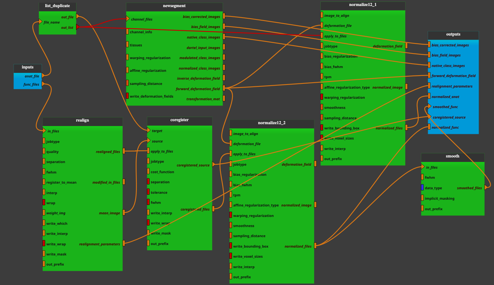

:orphan:

.. toctree::

+-----------------------------+-------------------------------------------+----------------------------------------------------+
|`Home <../../../index.html>`_|`Documentation <../../documentation.html>`_|`GitHub <https://github.com/populse/mia_processes>`_|
+-----------------------------+-------------------------------------------+----------------------------------------------------+

.. line break
.. |br| raw:: html

    

.. thin space
.. |ws1| raw:: html

   &thinsp;

.. em space

.. |ws2| raw:: html

   &emsp;

.. en space

.. |ws3| raw:: html

   &ensp;

.. non-breakable space

.. |ws4| raw:: html

   &nbsp;

====================================
Bold_spatial_preprocessing1 pipeline
====================================

An example of fMRI data pre-processing
--------------------------------------

**Pipeline insight**

- Bold_spatial_preprocessing1 pipeline combines the following bricks:
    - `List_Duplicate  <../../bricks/tools/List_Duplicate.html>`_
    - `NewSegment  <../../bricks/preprocess/spm/NewSegment.html>`_
    - `Normalize12 <../../bricks/preprocess/spm/Normalize12.html>`_
    - `Realign <../../bricks/preprocess/spm/Realign.html>`_
    - `Coregister  <../../bricks/preprocess/spm/Coregister.html>`_
    - `Smooth  <../../bricks/preprocess/spm/Smooth.html>`_

--------------------

**Inputs parameters**

- *anat_file*
    An anatomical image (ex. 3D T1 sequence such as T1 turbo field echo).
    An existing, uncompressed file (valid extensions: [.img, .nii, .hdr]).

    ::

      ex. /home/username/data/raw_data/Anat.nii

- *func_files*
    Functional images (ex. 3D T2* sequence such as echo planar imaging).
    A list of items which are an existing, uncompressed file (valid
    extensions: [.img, .nii, .hdr]).

    ::

      ex. ['/home/username/data/raw_data/Func.nii']

**Outputs parameters:**

- *bias_corrected_images*
    The bias corrected images (a list of items which are a pathlike object or
    string representing an existing file).

    ::

      ex. /home/username/data/derived_data/mAnat.nii

- *bias_field_images*
    The estimated bias field (a list of items which are a pathlike object or
    string representing an existing file).

    ::

      ex. <undefined>

- *native_class_images*
    Native space probability maps (a list of items which are a list of items
    which are a pathlike object or string representing an existing file).

    ::

      ex. [['/home/username/data/derived_data/c1Anat.nii'],
           ['/home/username/data/derived_data/c2Anat.nii'],
           ['/home/username/data/derived_data/c3Anat.nii'],
           ['/home/username/data/derived_data/c4Anat.nii'],
           ['/home/username/data/derived_data/c5Anat.nii']]

- *forward_deformation_field*
    Forward deformation field. Could be used for spatially normalising images
    to MNI space (a list of items which are a pathlike object or string
    representing an existing file).

    ::

      ex. /home/username/data/derived_data/y_Anat.nii

- *realignment_parameters*
    The estimated translation and rotation parameters during the realign
    stage (a list of items which are a pathlike object or string representing
    an existing file).

    ::

      ex. /home/username/data/derived_data/rp_Func.txt

- *normalized_anat*
    The final normalised anatomical image (a list of items which are a
    pathlike object or string representing an existing file).

    ::

      ex. /home/username/data/derived_data/wAnat.nii

- *smoothed_func*
    The final, realigned then registered with the anatomical image, then
    normalised then smoothed, functional images (a list of items which are
    an existing file name).

    ::

      ex. /home/username/data/derived_data/swrFunc.nii

- *coregistered_source*
    Coregistered source files, corresponding to `source` images
    (a list of items which are an existing file name).

    ::

      ex. /home/username/data/derived_data/meanFunc.nii

- *normalized_func*
    Functional images, realigned, registered with the anatomical image and
    normalized (a list of items which are an existing file name).

    ::

      ex. /home/username/data/derived_data/wrFunc.nii
