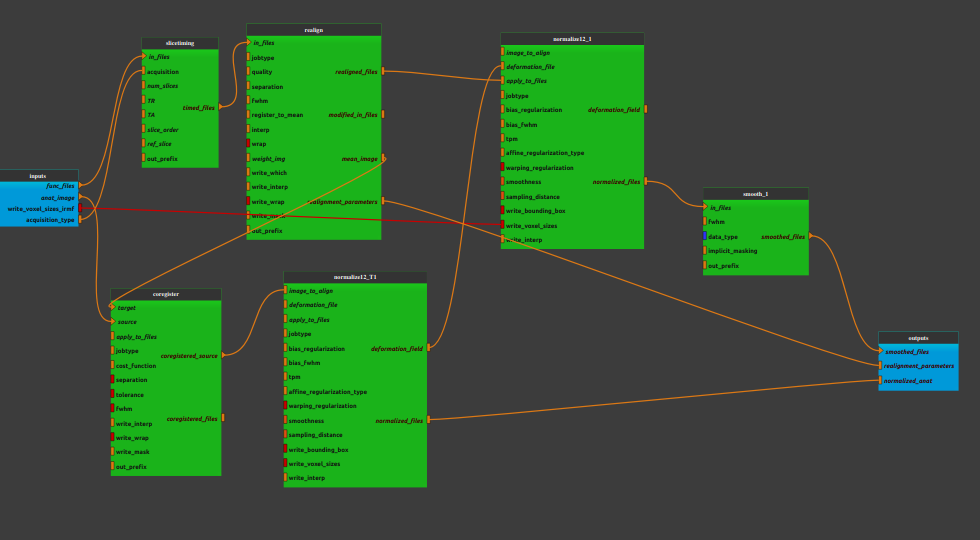

:orphan:

.. toctree::

+-----------------------------+-------------------------------------------+----------------------------------------------------+
|`Home <../../../index.html>`_|`Documentation <../../documentation.html>`_|`GitHub <https://github.com/populse/mia_processes>`_|
+-----------------------------+-------------------------------------------+----------------------------------------------------+

====================================
Bold_spatial_preprocessing2 pipeline
====================================

An example of fMRI data pre-processing
--------------------------------------

**Pipeline insight**

- Spatial_preprocessing pipeline combines the following bricks:
    - `Slice timing  <../../bricks/tools/List_Duplicate.html>`_
    - `Realign <../../bricks/preprocess/spm/Realign.html>`_
    - `Normalize12 Estimate & write <../../bricks/preprocess/spm/Normalize12.html>`_
        - (default values: jobtype = 'estwrite', bias_regularization = 0.0001, bias_fwhm = 30, write_interp = 4)
    - `Normalize12 Write <../../bricks/preprocess/spm/Normalize12.html>`_
        - (default values: jobtype = 'write', write_interp = 4)
    - `Coregister <../../bricks/preprocess/spm/Coregister.html>`_
    - `Smooth <../../bricks/preprocess/spm/Smooth..html>`_

--------------------

**Inputs parameters**

- *anat_file* (an existing uncompressed file):
    An anatomical image (valid extensions: [.nii]). Ex. 3D T1 sequence sush as T1 turbo field echo.

    ::

      ex. /home/username/data/raw_data/Anat.nii

- *func_files* (A list of items which are an existing uncompressed file)
    Functional images (valid extensions: [.nii]). Ex. 3D T2* sequence sush as echo planar imaging.

    ::

      ex. ['/home/username/data/raw_data/Func.nii']

**Outputs parameters:**

- *normalized_anat* (a list of items which are a pathlike object or string representing a file):
    The final normalised anatomical image.

    ::

      ex. /home/username/data/derived_data/wAnat.nii

- *realignment_parameters* (a list of items which are a pathlike object or string representing a file)
    The estimated translation and rotation parameters during the realign stage.

    ::

      ex. /home/username/data/derived_data/rp_Func.txt

- *smoothed_func*  (a list of items which are a file name)
    The final, realigned then coregistered then normalised then smoothed, functional images.

    ::

      ex. /home/username/data/derived_data/swrFunc.nii
