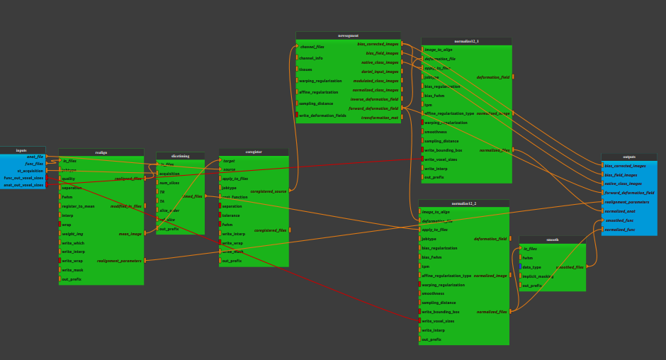

:orphan:

.. toctree::

+-----------------------------+-------------------------------------------+----------------------------------------------------+
|`Home <../../../index.html>`_|`Documentation <../../documentation.html>`_|`GitHub <https://github.com/populse/mia_processes>`_|
+-----------------------------+-------------------------------------------+----------------------------------------------------+

====================================
Bold_spatial_preprocessing3 pipeline
====================================

An example of fMRI data pre-processing
--------------------------------------

**Pipeline insight**

| The Bold_spatial_preprocessing2 pipeline combines the following bricks:
|   - `Realign <../../bricks/preprocess/spm/Realign.html>`_
|   - `Slice timing  <../../bricks/preprocess/spm/SliceTiming.html>`_
|   - `NewSegment  <../../bricks/preprocess/spm/NewSegment.html>`_
|   - `Coregister Estimate <../../bricks/preprocess/spm/Coregister.html>`_
|        (default values: jobtype = 'estimate')
|   - `Normalize12 Write <../../bricks/preprocess/spm/Normalize12.html>`_ (for T1w data)
|         (default values:
|                         jobtype = 'write', write_interp = 4,
|                         write_bounding_box = [[-78.0, -112.0, -70.0], [78.0, 76.0, 85.0]],
|                         write_voxel_size = [1.0, 1.0, 1.0]
|         )
|   - `Normalize12 Write <../../bricks/preprocess/spm/Normalize12.html>`_ (for functional data)
|       (default values:
|                          jobtype = 'write', write_interp = 4,
|                          write_bounding_box = [[-78.0, -112.0, -70.0], [78.0, 76.0, 85.0]],
|                          write_voxel_size = [3.0, 3.0, 3.0]
|       )
|   - `Smooth <../../bricks/preprocess/spm/Smooth..html>`_

-------------------------------------

**Inputs parameters**

- *anat_file* (an existing uncompressed file):
    An anatomical image (valid extensions: [.nii]). Ex. 3D T1 sequence sush as T1 turbo field echo.

    ::

      ex. '/home/username/data/raw_data/Anat.nii'

- *func_files* (A list of items which are an existing uncompressed file)
    Functional images (valid extensions: [.nii]). Ex. 4D T2* sequence sush as echo planar imaging.

    ::

      ex. ['/home/username/data/raw_data/Func.nii']

**Inputs parameters with default values**

- *st_acquistion* (a string, default is sequential ascending)
    Type of the acquisition, either sequential ascending, sequential descending, interleaved (middle-top), interleaved (bottom-up) or interleaved (top-down).
    Slice ordering is assumed to be from foot to head and bottom slice = 1.

    ::

      ex. 'sequential ascending'

- func_out_voxel_sizes(a list of three integer, default is [3.0, 3.0, 3.0])
    Voxel size of the out functional data (used for write_voxel_size in Normalize12 Write for functional data)

    ::

          ex. [3.0, 3.0, 3.0]

- anat_out_voxel_sizes(a list of three integer, default is [1.0, 1.0, 1.0])
    Voxel size of the out anatomical data (used for write_voxel_size in Normalize12 Write for anatomical data)

    ::

          ex. [1.0, 1.0, 1.0]

**Outputs parameters:**

- *bias_corrected_images* (a list of items which are a pathlike object or string representing an existing file)
    The bias corrected images.

    ::

          ex. '/home/username/data/derived_data/mAnat.nii'

- *bias_field_images* (a list of items which are a pathlike object or string representing an existing file)
    The estimated bias field.

    ::

      ex. '/home/username/data/derived_data/bias.nii'

- *native_class_images* (a list of items which are a list of items which are a pathlike object or string representing an existing file)
    Native space probability maps .

    ::

          ex. [['/home/username/data/derived_data/c1Anat.nii'],
              ['/home/username/data/derived_data/c2Anat.nii'],
              ['/home/username/data/derived_data/c3Anat.nii'],
              ['/home/username/data/derived_data/c4Anat.nii'],
              ['/home/username/data/derived_data/c5Anat.nii']]

- *forward_deformation_field* (a list of items which are a pathlike object or string representing an existing file)
    Forward deformation field. Could be used for spatially normalising images
    to MNI space.

    ::

          ex. '/home/username/data/derived_data/y_Anat.nii'

- *realignment_parameters* (a list of items which are a pathlike object or string representing an existing file)
    The estimated translation and rotation parameters during the realign
    stage.

    ::

          ex. '/home/username/data/derived_data/rp_Func.txt'

- *normalized_anat* (a list of items which are a pathlike object or string representing an existing file)
    The final normalised anatomical image .

    ::

          ex. '/home/username/data/derived_data/wAnat.nii'

- *normalized_func* (a list of items which are an existing file name)
    Functional images, realigned, registered with the anatomical image and
    normalized.

    ::

          ex. '/home/username/data/derived_data/wrFunc.nii'

- *smoothed_func* (a list of items which are an existing file name)
    The final, realigned then registered with the anatomical image, then
    normalised then smoothed, functional images .

    ::

          ex. '/home/username/data/derived_data/swrFunc.nii'
