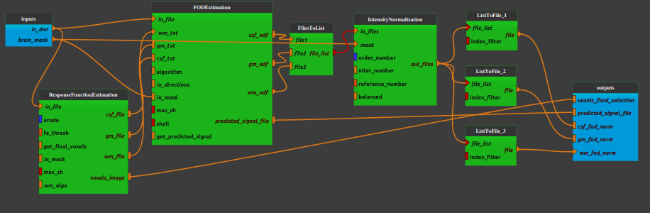

:orphan:

.. toctree::

+-----------------------------+-------------------------------------------+----------------------------------------------------+
|`Home <../../../index.html>`_|`Documentation <../../documentation.html>`_|`GitHub <https://github.com/populse/mia_processes>`_|
+-----------------------------+-------------------------------------------+----------------------------------------------------+

=========================
Dwi_fod_msmt_csd pipeline
=========================

Estimate DWI fiber orientation distribution (FOD)
--------------------------------------------------

The aim of this pipeline is to estimate the orientation of the fibers in each voxel using constrained spherical deconvolution (CSD).
To perform CSD, it is necessary to first estimate a "response function" (RF) which will be used as a kernel for deconvolution.
In this pipeline, we estimate a RF for each tissue type (using msmt_csd algorithm), so the input diffusion should contain **at least three
unique b-values to estimate three tissue compartments.**

| The following steps are done:
| - Estimate different response functions for the three different tissue types: white matter (WM), gray matter (GM), and cerebrospinal fluid (CSF)
| - In every voxel, estimate the orientation of all fibers crossing that voxel.
| - Correct the FOD for global intensity differences. This step helps to make the FODs comparable between several subjects (group study preparation)

--------------------------------------

**Pipeline insight**

| Dwi_fod_msmt_csd pipeline combines the following bricks:
|   - `Response function estimation <../../bricks/preprocess/mrtrix/ResponseSDDhollander.html>`_
|   - `Estimation of Fiber Orientation Distributions (FOD) <../../bricks/preprocess/mrtrix/ConstrainedSphericalDeconvolution.html>`_
       (default values: algorithm = "msmt_csd", get_predicted_signal = True)
|   - `Intensity Normalization <../../bricks/preprocess/mrtrix/MTNormalise.html>`_

**Mandatory inputs parameters**

- *in_dwi* (a string representing an existing file)
    Preprocessed diffusion image  (valid extensions: [.mif]).

    ::

      ex. '/home/username/data/raw_data/DWI_denoised_unringed_dwifslpreproc_unbias.mif'

- *brain_mask* (a string representing an existing file)
    DWI brain mask image.

    ::

      ex. '/home/username/data/derived_data/DWI_denoised_unringed_dwifslpreproc_unbias_brain_mask.mif'

**Outputs parameters:**

- *voxel_final selection* (a pathlike object or string representing a file)
    Image showing the final voxel selection for the estimate response functions

    ::

      ex. '/home/username/data/derived_data/DWI_denoised_unringed_dwifslpreproc_unbias_response_voxels.mif'

- *predicted_signal_file* (a pathlike object or string representing a file, optional)
    Predicted signal following the estimation of the FOD.

    ::

      ex. '/home/username/data/derived_data/DWI_denoised_unringed_dwifslpreproc_unbias_odf_predicted_signal.mif'

- *wm_odf_norm* (a pathlike object or string representing a file)
    Normalized WM fibre orientation distributions

    ::

      ex. '/home/username/data/derived_data/DWI_denoised_unringed_dwifslpreproc_unbias_wm_odf_norm.mif'

- *gm_odf_norm* (a pathlike object or string representing a file, optional)
    Normalized GM fibre orientation distributions

    ::

      ex. '/home/username/data/derived_data/DWI_denoised_unringed_dwifslpreproc_unbias_gm_odf_norm.mif'

- *csf_odf_norm* (a pathlike object or string representing a file, optional)
    Normalized CSF fibre orientation distributions

    ::

      ex. '/home/username/data/derived_data/DWI_denoised_unringed_dwifslpreproc_unbias_csf_odf_norm.mif'
