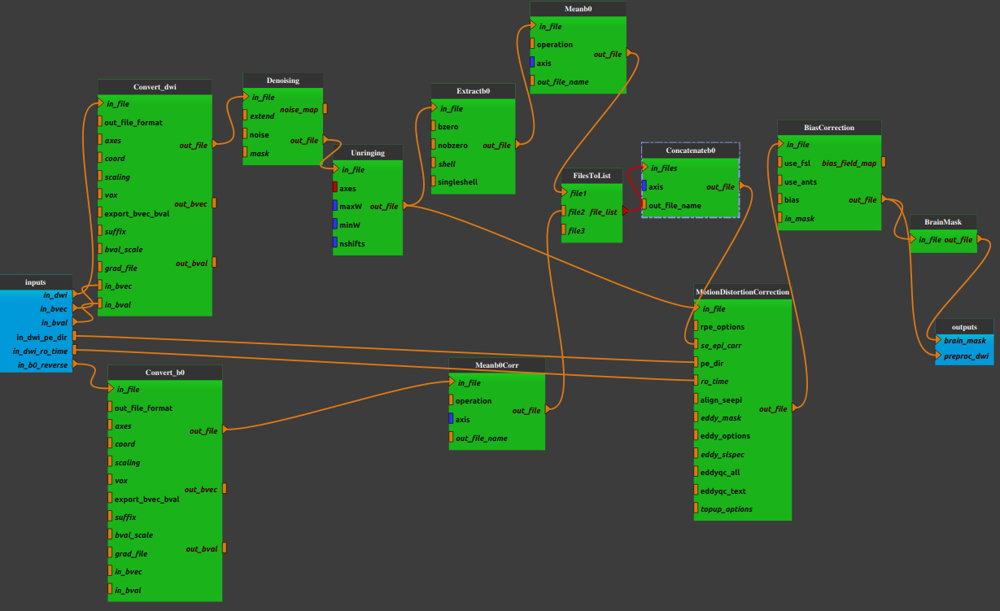

:orphan:

.. toctree::

+-----------------------------+-------------------------------------------+----------------------------------------------------+
|`Home <../../../index.html>`_|`Documentation <../../documentation.html>`_|`GitHub <https://github.com/populse/mia_processes>`_|
+-----------------------------+-------------------------------------------+----------------------------------------------------+

==========================
Dwi_preprocessing pipeline
==========================

DWI preprocessing using a reverse-phase encoded b0
--------------------------------------------------

The aim of this pipeline is to preprocess a multishell diffusion data before to analysed it.
In this pipeline, an image with b=0 volumes with opposite phase encoding should be provided for the purpose of EPI distortion correction.

| The following steps are done:
| - denoise the image and estimate the spatially varying noise map
| - remove Gibb’s ringing artefacts
| - motion and distortion correction (EPI-distrortion correction, B0-field inhomogeneity correction, Eddy-current and movement distortion correction )
| - bias field correction

A binary mask of the brain is also estimated.

--------------------------------------

**Pipeline insight**

| Dwi_preprocessing pipeline combines the following bricks:
|   - `Conversion into MIF format <../../bricks/preprocess/mrtrix/MRConvert.html>`_
|   - `b0 extraction <../../bricks/preprocess/mrtrix/DWIExtract.html>`_
|   - `b0 averaging <../../bricks/preprocess/mrtrix/MRMath.html>`_
|   - `b0 concatenation <../../bricks/preprocess/mrtrix/MRCat.html>`_
|   - `Denoising <../../bricks/preprocess/mrtrix/DWIDenoise.html>`_
|   - `Unringing <../../bricks/preprocess/mrtrix/MRDeGibbs.html>`_
|   - `Motion distorstion correction (Topup and eddy correction) <../../bricks/preprocess/mrtrix/DWIPreproc.html>`_
        (default values: rpe_options = "pair", eddy_options = " --slm=linear --data_is_shelled")
|   - `Bias correction <../../bricks/preprocess/mrtrix/DWIBiasCorrect.html>`_
|   - `Brain mask estimation <../../bricks/preprocess/mrtrix/DWIBrainMask.html>`_

**Mandatory inputs parameters**

- *in_dwi* (a string representing an existing file)
    Diffusion image to preprocess (valid extensions: [.nii, .nii.gz]).

    ::

      ex. '/home/username/data/raw_data/DWI.nii'

- *in_bvec* (a string representing an existing file)
    Direction of the gradient (b-vectors) of the in_dwi image (bvec file, valid extensions: [.bvec]).

    ::

      ex. '/home/username/data/raw_data/DWI.bvec'

- *in_bval* (a string representing an existing file)
    b values of the in_dwi image (bval file, valid extensions: [.bval]).

    ::

      ex. '/home/username/data/raw_data/DWI.bval'

- *in_dwi_pe_dir* (ap, pa, lr, rl, default value is ap, optional)
    | Phase encoding direction of the in_diw image:
    |   - ap : Anterior to posterior
    |   - pa: Posterior to anterior
    |   - lr: Left to right
    |   - rl: Right toleft

    ::

      ex. ap

- *in_dwi_ro_time* (a float, optional)
    Total readout time of in_dwi image (in seconds).

    ::

      ex. 2.0

- *in_b0_reverse* (a string representing an existing file)
    b=0 volumes with opposing phase-direction which is to be used exclusively by topup for estimating the inhomogeneity field
    (valid extensions: [.nii, .nii.gz]).

    ::

      ex. '/home/username/data/raw_data/b0_reverse.nii'

**Outputs parameters:**

- *brain_mask*
    DWI brain mask image.

    ::

      ex. '/home/username/data/derived_data/DWI_denoised_unringed_dwifslpreproc_unbias_brain_mask.mif'

- *preproc_dwi*
    DWI corrected image.

    ::

      ex. '/home/username/data/derived_data/DWI_denoised_unringed_dwifslpreproc_unbias.mif'
