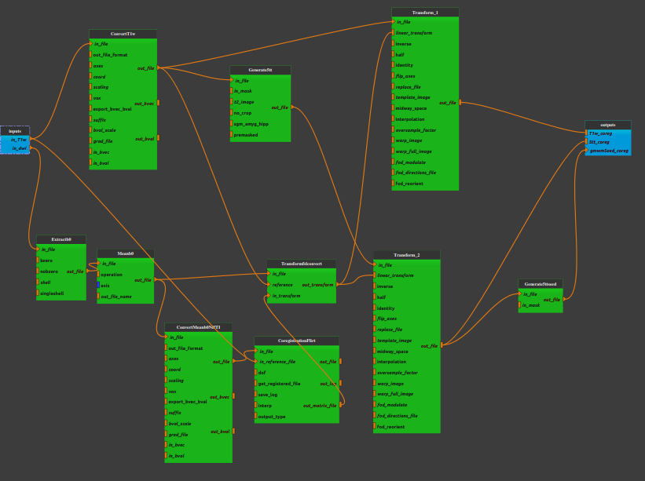

:orphan:

.. toctree::

+-----------------------------+-------------------------------------------+----------------------------------------------------+
|`Home <../../../index.html>`_|`Documentation <../../documentation.html>`_|`GitHub <https://github.com/populse/mia_processes>`_|
+-----------------------------+-------------------------------------------+----------------------------------------------------+

==============================
Dwi_tissue_boundaries pipeline
==============================

Create tissue boundaries with a T1w and registratiojn in DWI space
--------------------------------------------------------------------

The aim of this pipeline is to prepare Anatomically Constrained Tractography (ACT) to increase the biological plausibility of streamline creation when tracking will be performed.

| The following steps are done:
| - Create a 5tt-image i.e a 4-dimensional preprocessed T1-weighted image with 5 different tissue types (cortical gray matter, subcortical gray matter, white matter, CSF and pathological tissue). It will allow to define where streamlines must not end.
| - Co-registration of the 5tt-image to the diffusion image
| - Create a mask of the gray-matter/white-matter-boundary in the diffusion space. It will allow to define where streamlines must start.

Note that this pipeline used the FLIRT registration (FSL) to co-register diffusion and anatomical data as suggested in the `B.A.T.M.A.N. tutorial <https://osf.io/fkyht/>`_.
However it seems to not work perfectly for some data. Please check the outputs data.

--------------------------------------

**Pipeline insight**

| Dwi_tissue_boundaries pipeline combines the following bricks:
|   - `Conversion into MIF or NIfTI format <../../bricks/preprocess/mrtrix/MRConvert.html>`_ (if necessary)
|   - `b0 extraction <../../bricks/preprocess/mrtrix/DWIExtract.html>`_
|   - `b0 averaging <../../bricks/preprocess/mrtrix/MRMath.html>`_
|   - `Generate a 5TT image  <../../bricks/preprocess/mrtrix/Generate5ttfsl.html>`_
|   - `Coregistration using FLIRT <../../bricks/preprocess/fsl/Flirt.html>`_
        (default values: dof = 6, interp=nearestneighbour)
|   - `Convert FSL's transfomation to mrtrix format  <../../bricks/preprocess/mrtrix/TransformFSLConvert.html>`_
|   - `Apply spatial transfomation <../../bricks/preprocess/mrtrix/MRTransform.html>`_
        (default values: inverse = True)
|   - `Preparing a mask of streamline seeding <../../bricks/preprocess/mrtrix/Generate5tt2gmwmi.html>`_

**Mandatory inputs parameters**

- *in_dwi* (a string representing an existing file)
    Preprocessed diffusion image (valid extensions: [.mif]).

    ::

      ex. '/home/username/data/raw_data/DWI_denoised_unringed_dwifslpreproc_unbias.nii'

- *in_T1w* (a string representing an existing file)
    Anatomical image (valid extensions: [.nii, .nii.gz]).

    ::

      ex. '/home/username/data/raw_data/T1w.nii'

**Outputs parameters:**

- *T1w_coreg*
    Anatomical image coregistered in DWI space.

    ::

      ex. '/home/username/data/derived_data/T1w_transformed.mif'

- *5tt_coreg*
    5tt image (a 4-dimensional preprocessed T1-weighted image with 5 different tissue types (cortical gray matter, subcortical gray matter, white matter, CSF and pathological tissue)) coregistered in DWI space.

    ::

      ex. '/home/username/data/derived_data/T1w_5tt_transformed.mif'

- *gmwmSeed_coreg*
    A mask of the gray-matter/white-matter-boundary in DWI space.

    ::

      ex. '/home/username/data/derived_data/T1w_5tt_transformed_gmwmSeed.mif'
