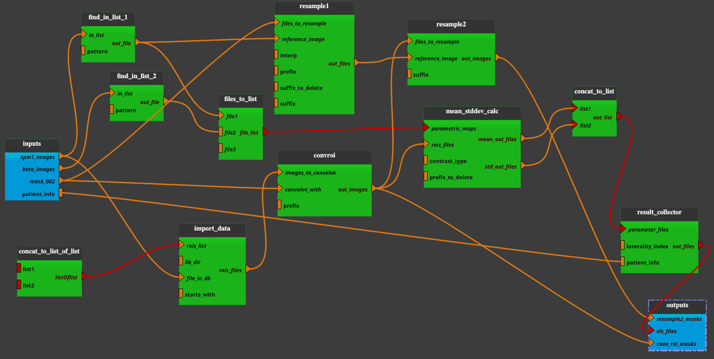

:orphan:

.. toctree::

+--------------------------------+----------------------------------------------+----------------------------------------------------+
|`Home <../../../../index.html>`_|`Documentation <../../../documentation.html>`_|`GitHub <https://github.com/populse/mia_processes>`_|
+--------------------------------+----------------------------------------------+----------------------------------------------------+

==========================
Extract_roi_param pipeline
==========================

Blabla
------

**Pipeline insight**

- Extract_roi_param pipeline combines the following bricks:
    - `Concat_to_list_of_list <../../bricks/tools/Concat_to_list_of_list.html>`_
    - `Import_Data <../../bricks/tools/Import_Data.html>`_
    - `Find_In_List <../../bricks/tools/Find_In_List.html>`_
    - `Files_To_List <../../bricks/tools/Files_To_List.html>`_
    - `ConvROI <../../bricks/preprocess/others/ConvROI.html>`_
    - `Resample1 <../../bricks/preprocess/others/Resample1.html>`_
    - `Resample2 <../../bricks/preprocess/others/Resample2.html>`_
    - `Mean_stdDev_calc <../../bricks/reports/Mean_stdDev_calc.html>`_
    - `Concat_to_list <../../bricks/tools/Concat_to_list.html>`_
    - `Result_collector <../../bricks/reports/Result_collector.html>`_

--------------------------------------

**Inputs parameters:**

**Outputs parameters:**
