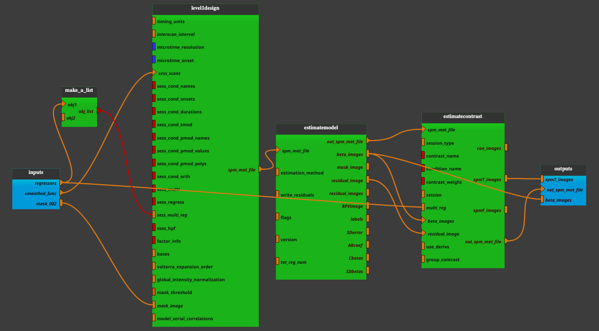

:orphan:

.. toctree::

+--------------------------------+----------------------------------------------+----------------------------------------------------+
|`Home <../../../../index.html>`_|`Documentation <../../../documentation.html>`_|`GitHub <https://github.com/populse/mia_processes>`_|
+--------------------------------+----------------------------------------------+----------------------------------------------------+

===============
Bold_Stat brick
===============

**Pipeline insight**

- Bold_Stat pipeline combines the following bricks:
    - `Level1Design <../../bricks/stats/spm/Level1Design.html>`_
    - `EstimateModel <../../bricks/stats/spm/EstimateModel.html>`_
    - `EstimateContrast <../../bricks/stats/spm/EstimateContrast.html>`_

--------------------------------------

**Inputs parameters:**

- *regressors*
    blabla

    ::

      ex.

- *smoothed_func*
    blabla

    ::

      ex.

- *mask_002*
    blabla

    ::

      ex.

**Outputs parameters:**

- *spmT_images*
    blabla

    ::

      ex.

- *out_spm_mat_file*
    blabla

    ::

      ex.

- *beta_images*
    blabla

    ::

      ex.
